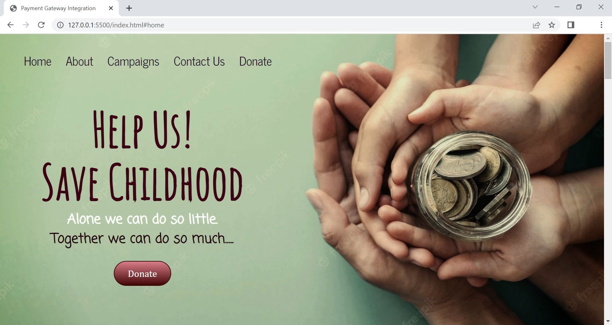
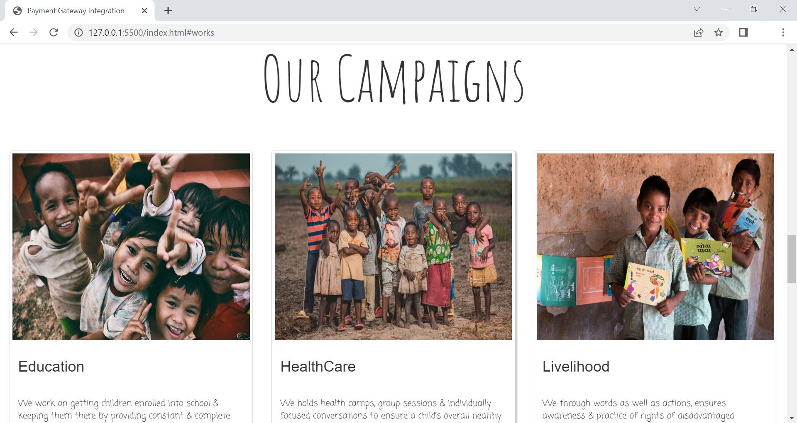
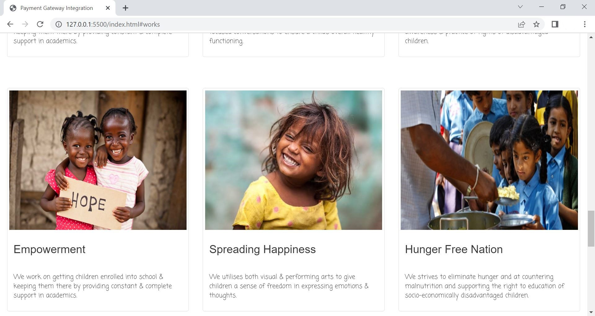
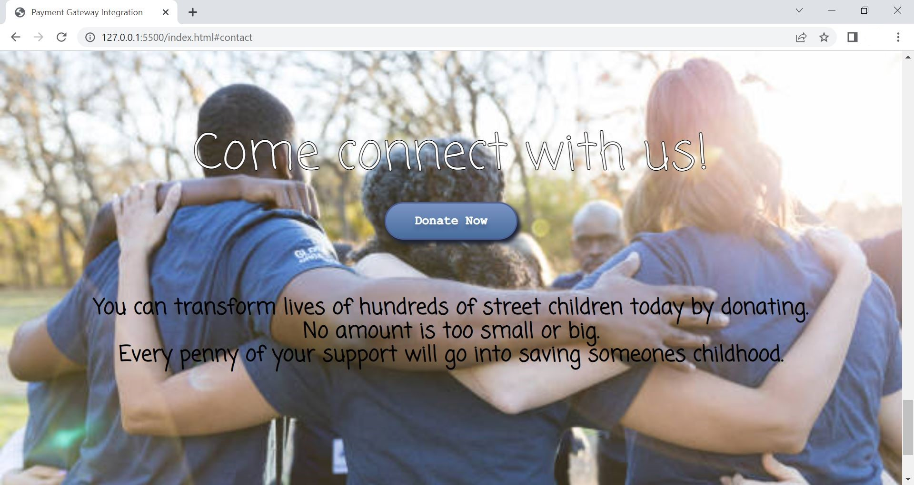
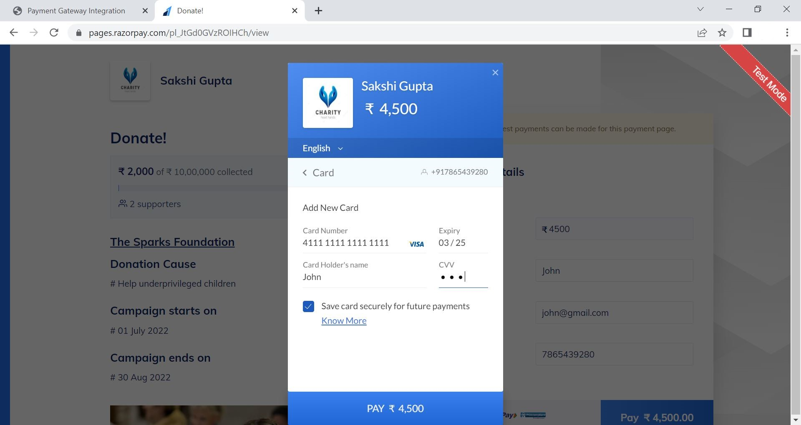

# Donation-Website

A simple website where __Payment Gateway__ is integrated.

## Features

- There is a donate button on homepage. On clicking the donate button, the user will land on the payment page where user can select the amount to be paid and the payment type, e.g. credit card, Paypal, etc.

- Once the payment is done, an invoice will be generated and email will be sent to the user for the payment received. The invoice will contain the amount and details of the person who donated through the website.

- The homepage contains the basic information regarding the website.

## Tech Stack

**Languages Used:** HTML, CSS, BOOTSTRAP, jQuery

**Payement Gateway:** RazorPay API

### Deployed On :

## Screenshots

### 1. Homepage

### 2. About Us

### 3. Our Campaigns 

### 4. Donate

### 5. Payment Gateway

